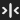

# Xpunge Alt.Icon

This is a **fork** of [**Xpunge**](http://www.theodoretegos.net/mozilla/tb/), a [Thunderbird](https://www.thunderbird.net/) extension that empties the Trash and Junk folders, and compacts folders in multiple accounts.

**Xpunge Alt.Icon** simply provides an **alternative** main **icon** more aligned with Thunderbird's toolbar icon design.

Icon Variations (sub-releases):  
- black (`black`)  
   _(light theme only)_
- gray transparent (`gray_ts`)  
  
- green (`green`)  
  
- red (`red`)  
  
- white (`white`)  
   _(dark theme only)_

Homepage:  
GitHub - https://github.com/Gregory-K/Xpunge.Alt.Icon  

Version:  
**4.0.2.1**  
Compatibility:  
115.0a1 <= Thunderbird version <= 115.*

## Install / Update

Download the latest .xpi [release from GitHub](https://github.com/Gregory-K/Xpunge.Alt.Icon/releases) and install it manually into Thunderbird.  
_(drag 'n drop OR "gear menu > Install Add-on From File...")_

Repeat for updates.  
_The "Xpunge Alt.Icon" follows the official "Xpunge" releases by adding an extra decimal place at the end._

## Caution

This altered extension was only intended for the author's personal use, and it doesn't offer anything more than a different main icon design. It was plain experimentation now being offered "as is" for anyone to try. It is neither digitally signed nor distributed via the official Thunderbird channels.

You should not use unsigned Add-ons outside the official [Thunderbird Add-ons Repository](https://addons.thunderbird.net/thunderbird/), unless you trust the author/developer or you're able to inspect the source code. It is a serious security risk. The author of the present extension disclaims any responsibility for any damage caused to your Thunderbird installation and Xpunge settings.

If you are not sure about using this extension, please prefer the official one bellow.

## Notes

The present repository contains only the files needed for an .xpi release.

Versioning: one decimal after the official one  
e.g. `3.0.0` (official) `3.0.0.1` (Alt.Icon)

---

# Official "Xpunge" extension

[Homepage](http://www.theodoretegos.net/mozilla/tb/)

[Thunderbird Add-ons listing](https://addons.thunderbird.net/en-us/thunderbird/addon/xpunge/)
